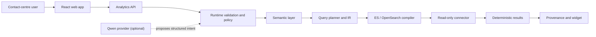

# Architecture overview

The MVP is a TypeScript modular monolith with separately runnable web and API processes. Shared packages own contracts and deterministic analytics. PostgreSQL metadata and real connectors follow behind stable interfaces; the first slice uses versioned fixtures and a synthetic connector.

The AI boundary is deliberately upstream of validation. Dashboards never depend on model availability.
