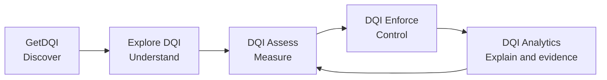
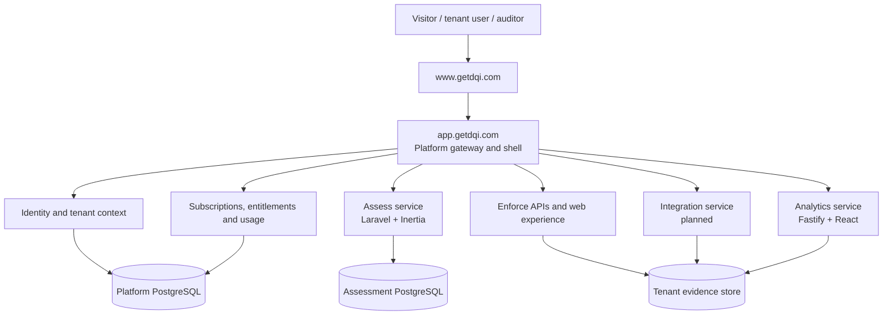
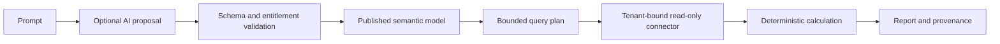

# DQI platform architecture

## 1. Purpose

DQI is a connected governance platform for measuring organisational readiness, applying controls to live AI activity and producing defensible evidence. Each product is separately purchasable and independently deployable, while the demonstration exposes the complete journey.

- **GetDQI** is the public front door.
- **Explore DQI** is the interactive framework and standards explorer.
- **DQI Assess** measures maturity and establishes a baseline.
- **DQI Enforce** applies and observes runtime governance.
- **DQI Analytics** turns governed evidence into traceable reporting.
- **DQI Integrate** is the planned collection, normalisation and routing capability.

The architectural principle is: one customer experience and trust model, multiple bounded product services.

## 2. Customer journey



A visitor starts at `www.getdqi.com`, opens the framework explorer or a product demo, and can move between products using the shared product switcher. "DQI Home" returns to the public front door; "Explore DQI" opens the interactive framework wheel. Demo access does not imply a production entitlement. Customers request real-solution access through `dqi@q4it.eu`.

## 3. System context



The target public and authenticated routes are:

| Route | Responsibility |
|---|---|
| `www.getdqi.com` | Public discovery, plans, contact and product entry |
| `app.getdqi.com/assess` | Authenticated Assess experience |
| `app.getdqi.com/enforce` | Authenticated Enforce experience |
| `app.getdqi.com/analytics` | Authenticated Analytics experience |
| `app.getdqi.com/account` | Organisation, users, subscription and usage |
| `app.getdqi.com/api/*` | Gateway-routed product APIs |

The products may remain on separate service hosts during the demo. The shared shell, theme and navigation provide continuity until gateway routing is introduced.

## 4. Product ownership

| Capability | Owning bounded context |
|---|---|
| Public product information and contact | GetDQI |
| Interactive framework wheel and standards | Explore DQI |
| Users, organisations and memberships | Platform identity |
| Plans, payment state, entitlements and quotas | Platform billing |
| Assessment catalogue, responses and scores | Assess |
| Policies, decisions and runtime controls | Enforce |
| Evidence collection and normalisation | Integrate / Enforce |
| Semantic models, calculations and reports | Analytics |
| Cross-product audit events | Platform audit |

Products must consume ownership data through contracts; they must not create competing sources of truth.

## 5. Identity and tenancy

The target identity model contains:

- `users`
- `tenants`
- `tenant_memberships`
- `roles`
- `invitations`
- `service_accounts`

A user can belong to more than one tenant. Selecting a tenant creates a server-verified tenant session. Browser state such as `selected_tenant_id` is a user-interface hint and never proof of access.

A verified request context should provide at least:

```json
{
  "subject": "user-id",
  "tenantId": "tenant-id",
  "roles": ["tenant_admin"],
  "entitlements": ["assess.run", "analytics.view"],
  "correlationId": "request-id"
}
```

Prefer secure, HTTP-only, same-site cookies for browser sessions. Service-to-service requests use short-lived workload credentials. Secrets and runtime API keys must not be persisted in browser storage.

## 6. Products, plans and entitlements

Products are separately purchasable. Plans are bundles of capabilities and limits rather than conditionals embedded in the UI.

Example capabilities:

- `assess.run`
- `assess.results.read`
- `assess.builder.manage`
- `enforce.policy.read`
- `enforce.policy.manage`
- `enforce.runtime.execute`
- `analytics.dashboard.read`
- `analytics.dashboard.create`
- `analytics.export`
- `platform.users.manage`
- `platform.billing.manage`

Example limits:

- seats
- assessments per month
- retained result days
- enforcement events per month
- analytics queries per month
- dashboards
- connectors

The UI uses entitlements to show, hide or lock navigation. Every API repeats the check server-side. Payment-provider webhooks update subscription state; the application never trusts payment claims sent by the browser.

## 7. Evidence and event flow

Cross-product integration uses versioned domain events:

```text
assessment.started
assessment.completed
assessment.score.calculated
enforce.policy.evaluated
enforce.request.blocked
enforce.finding.created
usage.tokens.recorded
integration.connected
```

Every event includes `eventId`, `occurredAt`, `tenantId`, `sourceProduct`, `schemaVersion`, `correlationId` and a product-specific payload. Sensitive values are classified and minimised before persistence.

Assess remains authoritative for scores. Enforce remains authoritative for runtime decisions. Analytics reads evidence and calculates reports without changing source records.

## 8. Analytics trust boundary

Natural-language requests are untrusted. A language model may propose semantic intent, but it must not generate executable datastore queries or calculate governed results.



Connectors are selected by the server from the verified tenant context. Index names, database identifiers and connection secrets are never accepted directly from the browser.

## 9. Security controls

Production minimum controls are:

1. OIDC-compatible authentication and short-lived sessions.
2. Server-verified tenant membership on every protected request.
3. RBAC plus capability entitlements.
4. Tenant isolation in application queries and database policies.
5. Encryption in transit and at rest.
6. Managed secrets, rotation and least-privilege service identities.
7. Input validation, bounded queries and rate limits.
8. Immutable security and administrative audit events.
9. Data classification, masking, retention and deletion workflows.
10. Cross-tenant negative tests in CI.
11. Dependency, container and infrastructure scanning.
12. Backup, restore and incident-response exercises.

Public assessment links require scoped ownership tokens. Completed shared results must expose only fields explicitly approved for sharing.

## 10. Deployment

Each repository builds and deploys independently from its `main` branch. Render is the current demonstration platform.

- GetDQI: static site.
- Assess: Dockerised Laravel, nginx, PHP-FPM and PostgreSQL.
- Enforce: Vite React application backed by DQI APIs.
- Analytics: Dockerised Fastify serving its React build and API.

Production should add a managed gateway, common domain, central identity, durable PostgreSQL, structured logs, metrics, tracing and environment-specific configuration. Migrations run as a release operation rather than independently in every horizontally scaled instance.

## 11. Shared experience

The canonical visual language originates in Analytics:

- DM Sans for interface copy.
- Manrope for headings.
- Navy canvas and surfaces.
- Mint primary action.
- Violet analytical accent.
- Amber assessment accent.
- Consistent product switcher and contact action.

A shared package can eventually distribute tokens and shell components. Until the runtimes are consolidated, repositories keep compatible local implementations to avoid coupling deployments.

## 12. Demo versus production

The demo deliberately links all products and may use synthetic or showcase data. It must be visibly labelled and must not imply that access control or billing has been granted.

Production requires:

- real identity and tenant membership;
- server-side entitlements;
- payment and subscription lifecycle;
- tenant-scoped persistence and connectors;
- production monitoring and support;
- contractual retention and availability controls.

The product switcher is navigation, not authorisation.

## 13. Delivery sequence

1. Maintain the connected demo and consistent design.
2. Establish versioned identity, tenant, entitlement and event contracts.
3. Introduce the platform gateway and common authenticated shell.
4. Add tenant ownership to Assess records.
5. Enforce tenant membership across Enforce APIs.
6. Add tenant-bound evidence connectors to Analytics.
7. Connect subscription webhooks, quotas and usage reconciliation.
8. Add SSO, audit export, retention controls and enterprise isolation.
9. Move to shared-domain routing without rewriting product domain engines.

## 14. Architectural decisions

- Keep product services independently deployable.
- Keep deterministic scoring and analytics separate from optional AI enrichment.
- Use GetDQI as the public starting point.
- Use one verified tenant context across products.
- Represent commercial access as entitlements and limits.
- Integrate products with contracts and events, not shared database tables.
- Prefer a modular platform before introducing additional microservices.
